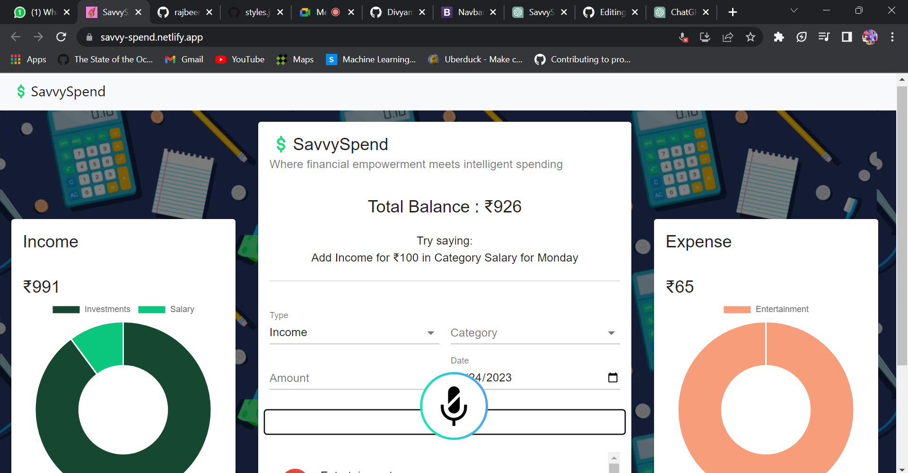

# Fastest Coder First Hackathon

Figma prototype link: https://www.figma.com/file/gv1KGCHrne3whhJDDX0JKV/Expense_Tracker?type=design&node-id=3%3A95&mode=design&t=5x9Lz46sJMfGawcc-1

## Team members
Divyam Malik
 
Akshavya Aggarwal
 
Rajbeer Singh
 
Viren Walia
 

<h2>Money Tracking website with voice command</h2>
<h2>Screenshot</h2>

## Github Capilot
GitHub Copilot, an AI-based coding assistant, played a significant role in the development of the Finance Tracker application. By harnessing the capabilities of machine learning, GitHub Copilot provided intelligent suggestions for code implementation, resulting in a more streamlined coding process. Here are some of the contributions made by GitHub Copilot to the app's development:

Code Generation: GitHub Copilot greatly aided in generating boilerplate code for various sections of the application, such as server routes, database queries, and user interface components. By automatically generating code snippets based on the specific context and requirements, it saved valuable time and reduced the need for manual coding from scratch.

Syntax and Error Correction: GitHub Copilot proved to be invaluable in identifying syntax errors and providing suggestions for their correction. By analyzing the code context, it offered real-time feedback to prevent common mistakes, typos, and missing parentheses. This significantly improved the quality of the code and minimized the time spent on debugging, allowing me to focus more on implementing the application logic.

Smart Auto-completion: GitHub Copilot's auto-completion features were highly useful in expediting the development process. It suggested intelligent variable names, function arguments, and method calls, enabling me to write code faster and maintain consistency throughout the application.

Overall, GitHub Copilot's assistance greatly enhanced the efficiency and effectiveness of the development process for the Finance Tracker application.

## HOW WE USED GITHUB CAPILOT
In the development of my Finance Tracker object, I made extensive use of GitHub Copilot as my coding companion. GitHub Copilot, powered by artificial intelligence, played a crucial role in enhancing the efficiency and effectiveness of the coding process. It provided intelligent code suggestions and helped streamline the implementation of various functionalities within the Finance Tracker. By leveraging its machine learning capabilities, Copilot generated boilerplate code for different sections of the object, including data handling, calculations, and user interface components. This significantly saved me time and effort that would have otherwise been spent on manual coding from scratch. Moreover, Copilot proved invaluable in catching syntax errors and offering suggestions for correction, thereby improving the overall code quality and reducing the debugging time. Its smart auto-completion feature further expedited the development process by suggesting appropriate variable names, function arguments, and method calls. Thanks to GitHub Copilot's assistance, I was able to develop the Finance Tracker object more efficiently and maintain consistency throughout the codebase.

<h1>💲SavvySpend</h1>
 
 SavvySpend is a web application built using React.js that helps users track their expenses. It provides an intuitive interface for users to input their expenses, categorize them, and visualize their spending habits through interactive charts. 

<h2>Features</h2>
<ul>
        <li><strong>Expense Tracking:</strong> Users can add new expenses with details such as date, amount, category, and description.</li>
        <li><strong>Expense Categories:</strong> Expenses can be categorized into different categories like food, transportation, entertainment, etc.</li>
        <li><strong>Expense Visualization:</strong> Users can view their spending patterns through visual charts and graphs.</li>
        <li><strong>Filter and Sorting:</strong> Expenses can be filtered and sorted based on different criteria like date, amount, or category.</li>
        <li><strong>Data Persistence:</strong> User data is stored locally in the browser, allowing users to revisit the website and access their expense history.</li>
</ul>

<h2>Installation</h2>

<ol>
    <li>Clone the repository:</li>
</ol>

<pre><code>git clone https://github.com/your-username/savvyspend.git</code></pre>
<ol start="2">
    <li>Navigate to the project directory:</li>
</ol>
<pre><code>cd savvyspend</code></pre>
<ol start="3">
    <li>Install the dependencies:</li>
</ol>
<pre><code>npm install</code></pre>
<ol start="4">
    <li>Start the application:</li>
</ol>
<pre><code>npm start</code></pre>

    The app will be running at <a href="http://localhost:3000">http://localhost:3000</a>.

<h2>Usage</h2>
<ol>
    <li>Open your web browser and go to <a href="http://localhost:3000">http://localhost:3000</a>.</li>
    <li>To add a new transaction, click on the "Add Expense" button and choose if it is income or expense.</li>
    <li>You can also visualize these transactions from the pi-char</li>
    <li>You can see your total balance above</li>
    <li>To delete an expense, hover over the expense item and click on the delete icon.</li>
</ol>
<h2>Contributing</h2>

    Contributions are welcome! If you have any improvements or bug fixes, feel free to submit a pull request.

<h2>License</h2>

    This project is licensed under the <a href="LICENSE">MIT License</a>.

https://savvy-spend.netlify.app/

